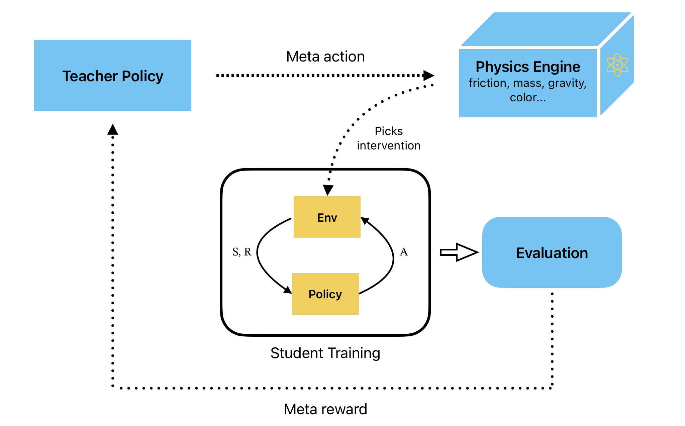

# AutoCaLC: A Causally Aligned Framework for Automated Curriculum Design

_Authors: Kausar Patherya, Batuhan Altundas, Matthew Gombolay_

## Overview

AutoCaLC is a framework that automatically creates learning sequences for robotic tasks using multiple specialized teachers supervised by a dean. The system has several teacher agents, each trained extensively on different environmental changes, and a dean agent that decides which teacher should guide the student at each moment to build robust skills.

## Core Method

AutoCaLC works like a school with specialized teachers and a dean. Each teacher is a PPO agent trained for extended periods (args.timesteps * 7) on a specific environmental change - one teacher specializes in goal variations, another in object mass changes, another in friction modifications, and so on. When the student robot faces a new situation, all teachers suggest what action to take and predict the expected reward.

The dean acts as the principal, watching all teacher recommendations and deciding which one the student should follow. The dean looks at how much teachers agree or disagree with each other, how confident each teacher seems about their suggestion, and which teacher's advice would best help the student learn to handle different environmental challenges.

The key insight is that when teachers disagree strongly about what action to take, this signals an important learning opportunity. The dean has learned to recognize these moments of uncertainty and guide the student toward the teacher whose expertise best fills the current knowledge gap.

Key components include specialized teacher PPO agents each trained for extended periods (args.timesteps * 7) under specific environmental interventions, a dean network that analyzes teacher response patterns to coordinate learning, policy transfer mechanisms where students learn from selected teacher demonstrations, uncertainty detection through teacher disagreement analysis, and continuous adaptation protocols for both teacher specialization and dean decision-making.

The framework uses teacher disagreement as a learning signal. When teachers provide conflicting action recommendations for the same state, this indicates areas where the student needs focused practice. The dean identifies these uncertainty moments by analyzing several signals: action variance across teachers (high variance indicates disagreement), confidence distributions from teacher value functions (low confidence suggests uncertainty), reward prediction disparities (different expected outcomes signal environmental complexity), and policy entropy differences (varying action randomness across teachers). Based on these signals, the dean selects the teacher whose expertise most directly addresses the identified uncertainty, using principles such as selecting teachers with highest confidence in uncertain regions, choosing specialists whose training intervention matches the current environmental challenge, prioritizing teachers whose value functions show strong performance gradients in the current state space, and balancing exploration (high uncertainty teachers) with exploitation (high confidence teachers) based on student learning progress.

## Baseline Methods

This repository provides comprehensive baseline comparisons for curriculum learning in robotic manipulation. The baselines include greedy curriculum that selects interventions with highest immediate reward, random curriculum with uniform intervention selection, causal mismatch scoring that ranks interventions by model disagreement, no curriculum baseline with standard environment training, RND intrinsic motivation using Random Network Distillation for exploration bonuses, count-based exploration rewarding novel state visitations, learning progress motivation based on transition model improvement, and information gain rewards for model uncertainty reduction.

## Usage

First ensure you have the required pretrained PPO models in the models/ directory. Run baseline experiments using the commands in baselines.py, which includes over 35 example commands for different curriculum modes, tasks, and configurations. Use the --replacement flag to allow repeated selection of the same intervention. All results are automatically organized in the logs/ directory with clear naming conventions.

For AutoCaLC multi-teacher training, use meta_teacher_student.py to train the dean-supervised teacher ensemble system. The framework first trains specialized teachers under different intervention regimes, then trains the dean network to coordinate teacher selection for optimal student learning progression. The dean learns to identify which teacher's expertise best addresses the student's current learning needs based on environmental state and teacher response diversity.

## Repository Structure

- `baselines.py`: Baseline curriculum methods with comprehensive documentation
- `meta_teacher_student.py`: AutoCaLC multi-teacher dean-supervised framework implementation
- `validation_actor.py`: Intervention validation and testing utilities
- `generate_visualizations.py`: Analysis and plotting tools
- `logs/`: Centralized directory for all experimental results
- `models/`: Pretrained PPO models for different tasks
- `sp25/`: The work I did as part of Dr. G's Interactive Robot Learning class
- `archive/`: Historical implementations and development files

All experiments support tasks including pushing, reaching, picking, pick_and_place, and stacking2 in the CausalWorld robotics simulation environment.
