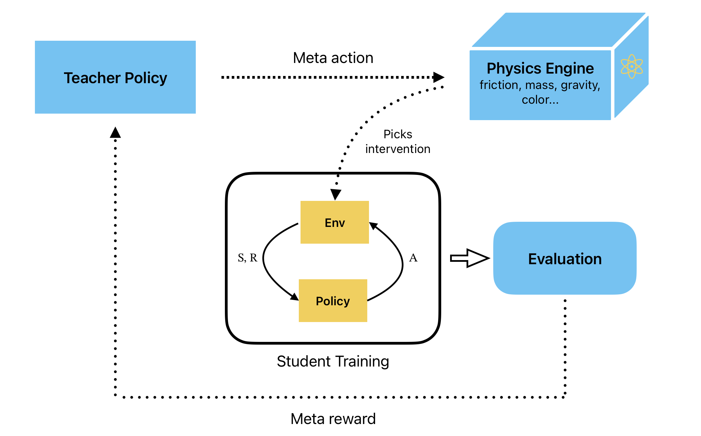

# AutoCaLC: A Causally Aligned Framework for Automated Curriculum Design

_Authors: Kausar Patherya, Batuhan Altundas, Matthew Gombolay_

## Overview

This repository introduces AutoCaLC, a meta-learning framework for automated curriculum design in robotic manipulation. AutoCaLC leverages a teacher-student architecture to adaptively select environmental interventions, aiming to maximize the student's generalization and robustness across diverse manipulation tasks.

## 'Core' Method

AutoCaLC operates by having a teacher agent select interventions based on the student's current learning state, measured through causal mismatch scores and reward feedback. The student agent, trained with PPO, adapts to these interventions, and its performance is evaluated on out-of-distribution validation environments to guide the teacher's future decisions.

## Baseline Methods

This repository provides comprehensive baseline comparisons for curriculum learning in robotic manipulation. The baselines include greedy curriculum that selects interventions with highest immediate reward, random curriculum with uniform intervention selection, causal mismatch scoring that ranks interventions by model disagreement, no curriculum baseline with standard environment training, RND intrinsic motivation using Random Network Distillation for exploration bonuses, count-based exploration rewarding novel state visitations, learning progress motivation based on transition model improvement, and information gain rewards for model uncertainty reduction.

## Usage

First ensure you have the required pretrained PPO models in the models/ directory. Run baseline experiments using the commands in baselines.py, which includes over 35 example commands for different curriculum modes, tasks, and configurations. Use the --replacement flag to allow repeated selection of the same intervention. All results are automatically organized in the logs/ directory with clear naming conventions.

For detailed instructions and example commands, see the comments and usage notes in baselines.py. All necessary pretrained models and logs are organized for easy access and reproducibility.

## Repository Structure

- `baselines.py`: Baseline curriculum methods with comprehensive documentation
- `meta_teacher_student.py`: AutoCaLC multi-teacher dean-supervised framework implementation
- `validation_actor.py`: Intervention validation and testing utilities
- `generate_visualizations.py`: Analysis and plotting tools
- `logs/`: Centralized directory for all experimental results
- `models/`: Pretrained PPO models for different tasks
- `sp25/`: The work I did as part of Dr. G's Interactive Robot Learning class
- `archive/`: Historical implementations and development files

All experiments support tasks including pushing, reaching, picking, pick_and_place, and stacking2 in the CausalWorld robotics simulation environment.
