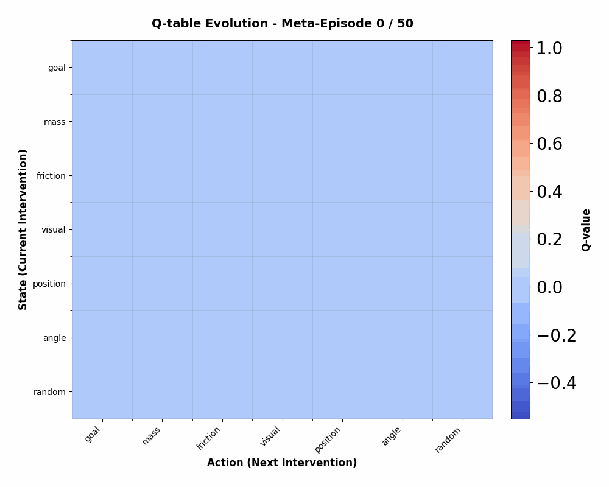

# AutoCaLC: A Causally-Aligned Framework for Automated Curriculum Design

_Kausar Patherya, Batuhan Altundas, Matthew Gombolay_  
_Georgia Institute of Technology_

---

## What is AutoCaLC?

AutoCaLC is a meta-learning framework that automatically designs curricula for robotic manipulation tasks. Instead of training on a single fixed environment, AutoCaLC adaptively selects which environmental variations (interventions) the robot should practice on next, accelerating learning and improving generalization to new scenarios.

**Key Innovation**: A tabular Q-learning teacher learns an optimal intervention sequence by tracking which interventions lead to the greatest improvement in the student robot's validation performance (learning progress).

<p align="center">
  
</p>

---

## How the Teacher Learns: Q-Table Evolution

Watch how the teacher's Q-table evolves across 50 meta-episodes, learning which intervention transitions yield the highest learning progress:

<p align="center">
  
</p>

**What you're seeing**: Each cell represents the expected learning progress (meta-reward) from transitioning between interventions. Warmer colors indicate higher expected gains. The teacher uses Upper Confidence Bound (UCB) exploration to balance trying new intervention sequences vs exploiting known effective transitions.

---

## The AutoCaLC Meta-Learning Loop

1. **Teacher selects intervention** using Q-table + UCB exploration
2. **Student trains** on selected intervention for K timesteps (PPO)
3. **Validation evaluation** on diverse out-of-distribution environments
4. **Meta-reward** = change in validation performance (learning progress)
5. **Q-table update** via Bellman equation to reinforce effective sequences
6. **Repeat** for M meta-episodes

---

## Why AutoCaLC Works

**No full retesting overhead**: Unlike greedy/CM baselines that re-evaluate all interventions each meta-episode, AutoCaLC remembers past outcomes via Q-values.

**Principled exploration**: UCB balances trying under-explored interventions vs exploiting known effective sequences.

---

## Baseline Comparisons

We benchmark AutoCaLC against comprehensive curriculum and exploration baselines:

### Intervention-Based Curricula
- **Greedy**: Selects intervention yielding highest immediate test reward
- **Causal Mismatch (CM)**: Ranks interventions by ensemble model disagreement
- **Random**: Uniformly samples interventions
- **None**: Trains without interventions (standard RL baseline)

### Intrinsic Motivation Baselines
- **RND**: Random Network Distillation for novelty-driven exploration
- **Count-based**: Rewards visiting under-explored states
- **Learning Progress Motivation (LPM)**: Rewards improvements in transition model accuracy
- **Information Gain**: Rewards actions that reduce model uncertainty

---

## Repository Structure

```
causal-core-su25/
├── meta_teacher_student_qtable.py    # AutoCaLC with tabular Q-learning teacher
├── baselines.py                      # All baseline implementations + 35+ example commands
├── validation_actor.py               # Validation environment evaluation utilities
├── visualize_baselines.py            # Analysis and plotting tools
├── create_validation_envs.py         # Generate diverse validation environments
├── tabularize_ood.py                 # Aggregate benchmark results across protocols
├── logs/                             # Centralized experimental results
├── models/                           # Pretrained PPO models (pushing, reaching, etc.)
├── envs/                             # Saved validation environment configurations
├── images/                           # Visualizations and diagrams
└── sp25/                             # Interactive Robot Learning coursework
```

---

## Quick Start

### Training AutoCaLC

```bash
# Basic training with evaluation
python meta_teacher_student_qtable.py --task pushing --meta_episodes 50 \
    --student_train_steps 50000 --alpha 0.1 --beta 1.0 --gamma 0.9 --eval --use_wandb

# Quick test run (debugging)
python meta_teacher_student_qtable.py --task pushing --meta_episodes 5 \
    --student_train_steps 1000 --validation_episodes 3
```

### Visualizing Q-Table Evolution

```bash
# Generate animated GIF showing Q-value evolution
python meta_teacher_student_qtable.py --heatmap --log_dir logs/autocalc_qtable
```

### Running Baselines

```bash
# No intervention baseline
python baselines.py --train --eval --curriculum_mode none --task pushing \
    --meta_episodes 50 --timesteps 50000

# Greedy curriculum
python baselines.py --train --eval --curriculum_mode greedy --task pushing \
    --meta_episodes 50 --timesteps 50000 --replacement

# RND intrinsic motivation
python baselines.py --train --eval --curriculum_mode rnd --task pushing \
    --meta_episodes 50 --timesteps 50000 --rnd_beta 0.01
```

See `baselines.py` header comments for 35+ additional training commands across all baselines and tasks.

---

## Supported Tasks

All experiments support manipulation tasks in the CausalWorld robotics simulator:

- **Pushing**: Move object to goal position via contact
- **Reaching**: Move end-effector to goal pose
- **Picking**: Grasp and lift object above threshold
- **Pick-and-Place**: Grasp and transport object to goal
- **Stacking2**: Stack two blocks on top of each other

Each task evaluates on 12 out-of-distribution protocols varying goals, physics, visuals, and initial states.

---

## Citation

If you use this work, please cite:

```bibtex
@misc{patherya2025autocalc,
  title={AutoCaLC: Automated Curriculum Learning via Causal Alignment},
  author={Patherya, Kausar and Altundas, Batuhan and Gombolay, Matthew},
  year={2025},
  institution={Georgia Institute of Technology}
}
```

---

## Acknowledgments

This work builds on the CausalWorld simulation environment and was developed as part of research in the CORE Robotics Lab at Georgia Tech under Dr. Matthew Gombolay's supervision.
